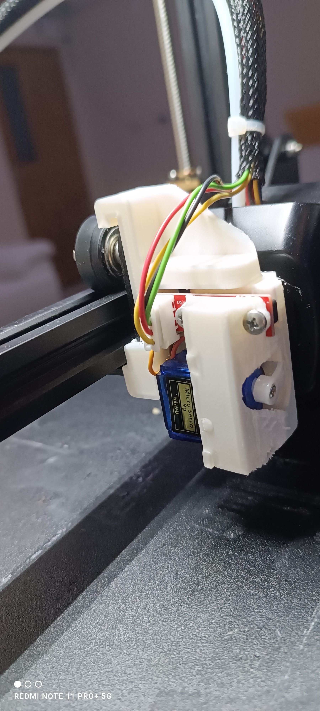
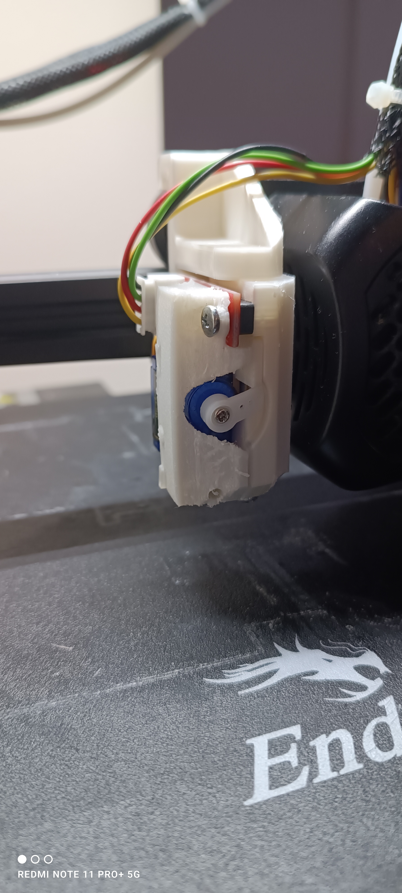
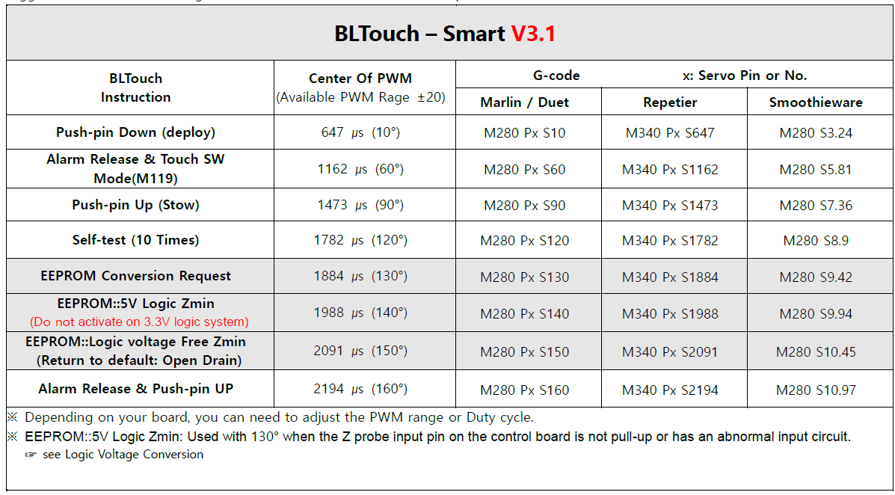

# Dil Seçimi
[English](README.md) | [Türkçe](README-tr.md)

# Ender3 V2 İçin BFPTouch Sensör Kurulumu


Bu kılavuz, düşük bütçeli bir BLTouch klonu olan BFPTouch'un Ender3 V2 yazıcınıza nasıl kurulup yapılandırılacağına dair ayrıntılı talimatlar sağlar. BFPTouch, BLTouch işlevselliğini taklit eder ve uygun maliyetli 3D baskı iyileştirmeleri için tasarlanmıştır. Başarılı bir donanım kurulumu ve yazılım yapılandırması için bu kılavuzu izleyin.

---

## Genel Bakış

BFPTouch, BLTouch'a bütçe dostu bir alternatif olup Ender3 V2 ile sorunsuz bir şekilde çalışacak şekilde tasarlanmıştır. BLTouch işlevselliğini taklit etmek için 3D baskılı bir montaj, küçük bir SG90 servo motor ve bir optik endstop kullanır. Montaj parçasını basarak ve birkaç basit adımı tamamlayarak, BFPTouch'u yazıcı kurulumunuza entegre edebilirsiniz.

---

## Gerekli Malzemeler

Bu modifikasyonu tamamlamak için aşağıdakilere ihtiyacınız olacak:

- **3D Baskılı BFPTouch Montaj Parçası**
  - Montaj parçasını Thingiverse'den indirin: [https://www.thingiverse.com/thing:6918868](https://www.thingiverse.com/thing:6918868)
  - PLA veya PETG kullanarak montaj parçasını en iyi sonuçlar için yazdırın.
- **1 x SG90 Servo Motor**
- **1 x Optik Endstop**
- **Lehimleme Araçları**: Lehimleme cihazı, lehim ve gerekirse flux.
- **Temel Araçlar**: Tornavidalar, pense ve kablo bağları.

---

## Donanım Kurulumu

1. **BFPTouch Montaj Parçasını Yazdırın**:
   - Verilen Thingiverse bağlantısından 3D modelini indirin.
   - Modeli tercih ettiğiniz 3D yazıcıyla yazdırın. Bileşenlerin doğru şekilde oturması için yazdırma kalitesinin yüksek olmasını sağlayın.

2. **Bileşenleri Monte Edin**:
   - SG90 servo motoru, yazdırılmış montaj parçasındaki belirlenmiş yuvaya yerleştirin.
   - Optik endstopu sağlanan yuvaya sabitleyin.
   - Kabloları, yazıcının hareketine müdahale etmeyecek şekilde düzenleyin.

3. **BFPTouch'u Yazıcıya Monte Edin**:
   - Yazdırılmış montaj parçasını, kurulu bileşenlerle birlikte vida yerine sıkı oturma tasarımı kullanarak Ender3 V2'ye takın.
   - Montaj parçasının sıkı bir şekilde yerine oturduğundan emin olun.

        
   
4. **Kablolamayı Bağlayın**:
   - Aşağıdaki kablo bağlantılarını takip ederek kurulumu tamamlayın:

     ```
     +------------------+-----------------------------+
     | Anakart Pinleri  | BFPTouch Pinleri            |
     +------------------+-----------------------------+
     | V                | SG90 VCC, Optik Endstop VCC |
     | G                | SG90 GND, Optik Endstop GND |
     | IN               | SG90 PWM Sinyali            |
     | OUT              | Optik Endstop Çıkışı        |
     +------------------+-----------------------------+
      ```

   - Tüm bağlantıların güvenli ve kısa devrelerden korunmuş olduğundan emin olun.

---

## Neden BFPTouch İçin Özel Bir Yapılandırma Gereklidir?

Genellikle, BFPTouch'un çalışma prensibi BLTouch'tan farklıdır. BLTouch, anakarttan gelen belirli servo sinyal açısını doğrudan açı komutları olarak değil, sensördeki bir mikrodenetleyici sayesinde belirli işlemler için talimat olarak yorumlar. Aşağıda, BLTouch için hangi açı değerlerinin hangi komutlara karşılık geldiğini gösteren bir görsel bulunmaktadır:



Buna karşılık, BFPTouch üzerinde herhangi bir denetleyiciye sahip değildir ve anakarttan gelen servo sinyali, SG90 servo motorunun açısını doğrudan kontrol eder. BFPTouch'un mekanik tasarımı nedeniyle, BLTouch komutlarına karşılık gelen açı değerleri, mekanik çarpışmalara neden olabilir. Bu nedenle, BFPTouch ile uyumlu hale getirmek için firmware'de belirli yapılandırmalar yapmamız gerekir.

---

## Yazılım Yapılandırması

Ender3 V2 firmware'inizi BFPTouch işlevselliği için yapılandırmanın iki yöntemi vardır:

### Seçenek 1: Önceden Derlenmiş Firmware Kullanımı

Sağlanan depo bağlantısından önceden yapılandırılmış firmware'i indirip flaşlayın. Bu, çoğu kullanıcı için en basit yöntemdir.

Depo Bağlantısı: [https://github.com/sezgynus/Ender3V2S1](https://github.com/sezgynus/Ender3V2S1)

### Seçenek 2: Marlin Firmware'i Manuel Olarak Yapılandırma

Firmware'i kendiniz yapılandırıp derlemeyi tercih ediyorsanız, bir sonraki bölümde verilen ayrıntılı talimatları izleyin. Marlin kaynak koduna ve uyumlu bir derleme ortamına sahip olduğunuzdan emin olun.

---

BFPTouch kurulumunuzu ve yazılım yapılandırmanızı tamamlamak için sonraki adımlarda bizimle kalın!
"""
