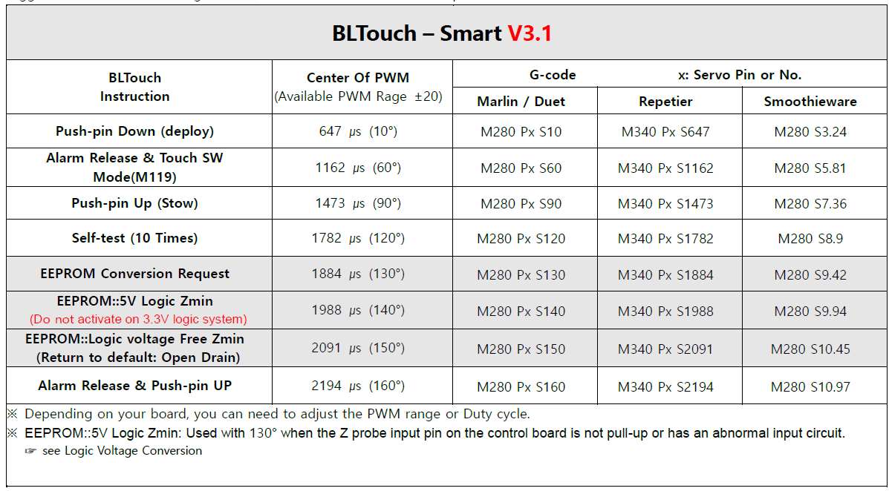
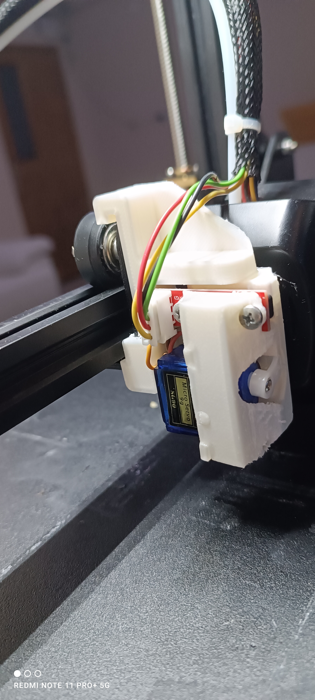
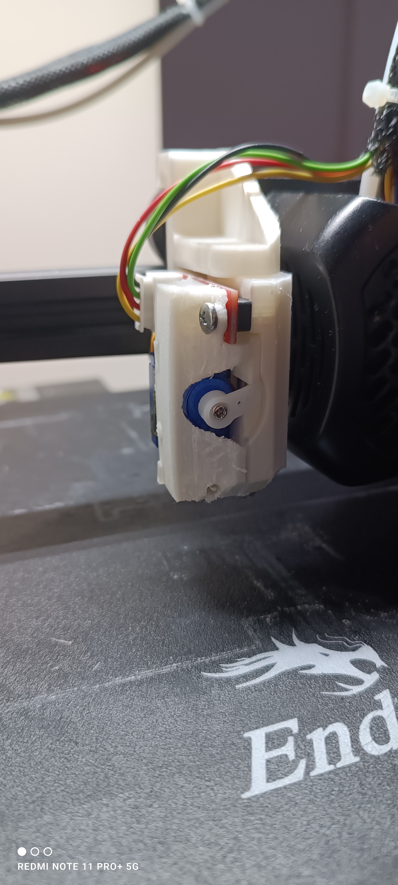

# BFPTouch Sensor Installation — Ender 3 V2

[English](README.md) | [Türkçe](README-tr.md) | [← Main Guide](../README.md)

This guide documents the BFPTouch installation implemented on an Ender 3 V2. The modification provides BLTouch-style probing with a **3D-printed mount**, **SG90 servo motor**, and **optical endstop**, while retaining the hardware and firmware differences of the controller-less BFPTouch design.

## At a Glance

| Area | Implementation |
|---|---|
| Target printer | Creality Ender 3 V2 |
| Probe concept | BFPTouch / BLTouch-style bed probing |
| Actuator | SG90 servo |
| Detection | Optical endstop |
| Mount | 3D printed, tight-fit installation |
| Mainboard connections | V, G, IN, OUT |
| Firmware paths | Pre-configured firmware or manual Marlin configuration |

## How the BFPTouch Differs from BLTouch

A BLTouch contains onboard control electronics. Servo-angle commands sent by the printer are interpreted as operational commands by the sensor.

The BFPTouch used here has no onboard controller. The mainboard's servo signal therefore controls the **SG90 angle directly**. Angles intended as BLTouch commands can consequently move the BFPTouch mechanism into unwanted positions or cause mechanical interference.

For this reason, the BFPTouch requires firmware behavior compatible with its direct servo actuation rather than assuming standard BLTouch command-angle behavior.

## Required Hardware

- **3D-printed BFPTouch mount**
  - Model: [Thingiverse 6918868](https://www.thingiverse.com/thing:6918868)
  - PLA or PETG can be used.
- **1 × SG90 servo motor**
- **1 × optical endstop**
- Soldering iron, solder and flux as required
- Screwdrivers, pliers and cable ties

## Hardware Installation

### 1. Print the Mount

Print the referenced BFPTouch mount with sufficient dimensional quality for the servo, optical endstop and tight-fit printer attachment.

### 2. Assemble the Probe

Install the SG90 servo and optical endstop in their corresponding locations. Route the wiring so that it cannot interfere with printer motion.

### 3. Install on the Printer

Attach the assembled BFPTouch to the Ender 3 V2 using the mount's tight-fit design and verify that the assembly is mechanically secure.

  
  
  

### 4. Connect the Mainboard

| Mainboard pin | BFPTouch connection |
|---|---|
| V | SG90 VCC + optical endstop VCC |
| G | SG90 GND + optical endstop GND |
| IN | SG90 PWM signal |
| OUT | Optical endstop output |

Verify the connections and insulation before applying power.

## Firmware Configuration

Two firmware paths are documented for this modification.

### Option 1 — Pre-configured Firmware

A pre-configured firmware implementation is available in the separate [Ender3V2S1 repository](https://github.com/sezgynus/Ender3V2S1).

This path avoids reproducing the firmware changes manually.

### Option 2 — Manual Marlin Configuration

The BFPTouch requires Marlin configuration compatible with the direct SG90 actuation described above. The repository establishes the hardware requirements and the reason standard BLTouch servo-angle assumptions cannot be used unchanged.

The detailed manual Marlin parameter set is **not present in this repository**, so values that are not documented here are intentionally not inferred.

## Verification Material

The repository contains several photographs and GIF demonstrations of the implemented probe:

| Asset | Purpose |
|---|---|
| `Photos/1.gif` | BFPTouch demonstration |
| `Photos/2.gif` | Main demonstration shown at the top of this guide |
| `Photos/1.jpg`–`Photos/5.jpg` | Physical installation references |
| `Photos/3.gif` | Close installation/mechanical reference |
| `Photos/6.png` | BLTouch command/angle reference used to explain the control difference |

## Safety and Mechanical Checks

Before homing or probing:

- verify that the probe can deploy and retract without colliding with the printer;
- confirm that the optical endstop changes state correctly;
- ensure the wiring cannot enter the motion path;
- test servo movement conservatively before relying on automatic Z movement.

The direct servo-control difference is important: firmware settings intended for another probe mechanism should not be assumed mechanically safe without verification.

## Project Scope

This sub-guide documents the BFPTouch hardware implementation and the firmware approach supported by the material currently stored in the repository. It does not add undocumented calibration values or Marlin parameters.

[← Return to the main upgrade guide](../README.md)
