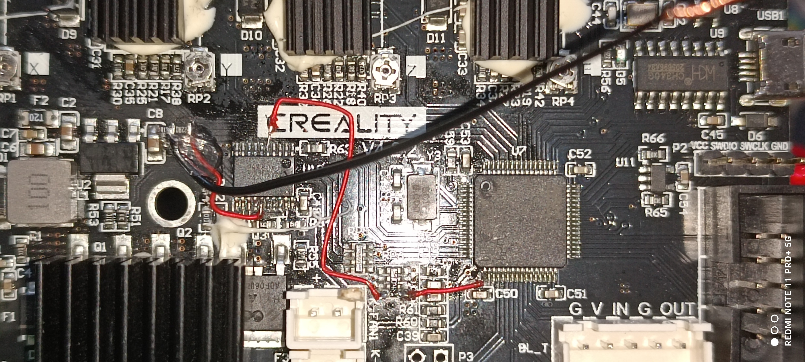
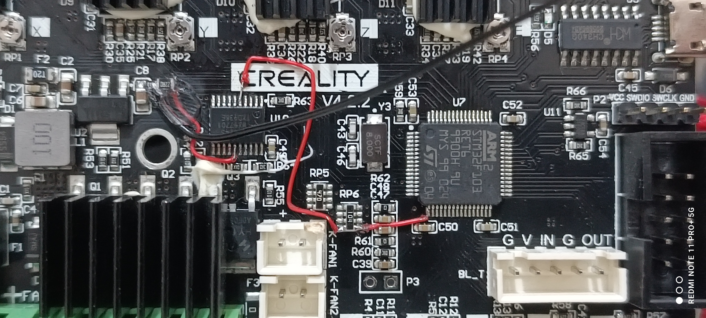
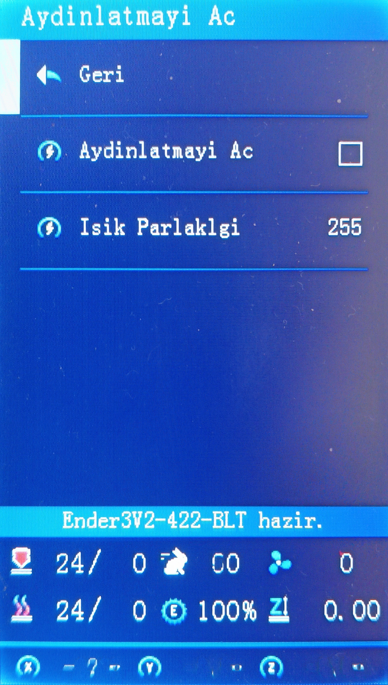
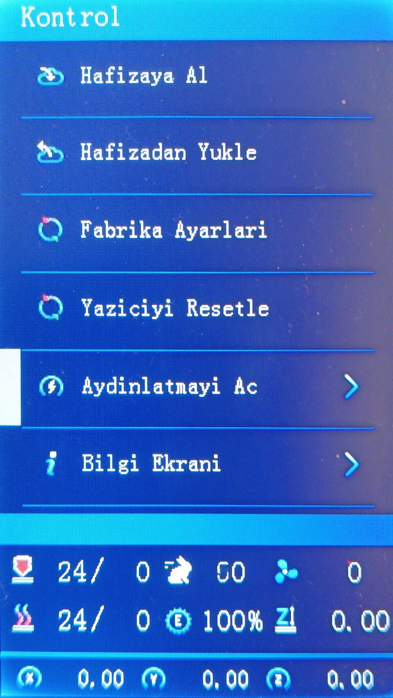

# Kasa Işığı Kontrolü — Ender 3 V2

[English](README.md) | [Türkçe](README-tr.md) | [← Ana Kılavuz](../README-tr.md)

Bu kılavuz, Ender 3 V2 anakartına **firmware kontrollü 24 V kasa aydınlatması** ekleyen donanım modifikasyonunu belgeler. Uygulamada MCU'nun **PA3** pini yeniden kullanılır, sinyal kullanılmayan bir HC245 kanalından geçirilir ve LED yükü harici bir N-channel MOSFET ile sürülür.

> **Donanım modifikasyonu:** işlem doğrudan yazıcı anakartına lehimleme gerektirir. Anakart üzerinde çalışmadan önce tüm gücü kesin ve enerji vermeden önce bütün bağlantıları doğrulayın.

## Hızlı Bakış

| Alan | Uygulama |
|---|---|
| Hedef yazıcı | Creality Ender 3 V2 |
| Firmware | Marlin |
| MCU kontrol pini | PA3 |
| Buffer | Kullanılmayan HC245 kanalı |
| MOSFET gate direnci | 10 Ω |
| Gate pulldown | 100 kΩ |
| LED beslemesi | 24 V |
| Kontrol komutu | `M355` |
| Parlaklık aralığı | 0–255 |
| Opsiyonel fast PWM | 31,4 kHz |

## Tasarım

Ender 3 V2 anakartında özel bir kasa ışığı çıkışı bulunmaz; buna karşılık Marlin kasa ışığı kontrolünü destekler. Modifikasyon, kullanılmayan bir işlemci sinyali etrafına gerekli güç çıkış katını ekler.

```text
MCU PA3
   │
   ▼
RP6 direnç ağı
   │
   ▼
Kullanılmayan HC245 kanalı
   │
   ▼
10 Ω seri direnç
   │
   ▼
N-channel MOSFET gate
   │
   ├── 100 kΩ pulldown → GND
   │
   ▼
24 V LED yükü
```


Depoda kart referansı olarak kullanılan Creality 4.2.2 şeması da `Diagrams/Creality.4.2.2.-.Schematic.pdf` altında bulunmaktadır.

## Gerekli Bileşenler

- **1 × 100 kΩ direnç**
- **1 × 10 Ω direnç**
- **1 × N-channel MOSFET**, en az 30 V drain-source gerilim değerine sahip
  - HY1403: Ender 3 V2 üzerinde ısıtıcı anahtarlamada da kullanılan MOSFET tipi
  - FR024N: belgelenmiş alternatif
- Havya, lehim ve flux
- MOSFET için isteğe bağlı breakout kart
- **24 V LED aydınlatma**

Belgelenen devre 24 V hattını anahtarladığından bağlanan aydınlatmanın 24 V çalışmaya uygun olması gerekir.

## Donanım Modifikasyonu

### 1. PA3 Bağlantısı

MCU'nun **PA3** sinyalini RP6 direnç ağının boş kanalına taşıyın.

### 2. HC245 Bağlantısı

RP6'dan gelen sinyali HC245 transceiver'ın kullanılmayan bir kanalından geçirin. Belgelenen uygulamada uygun olduğunda A3/B3 kanal çifti tercih edilir.

### 3. Gate Seri Direnci

HC245 çıkışını **10 Ω** seri direnç üzerinden MOSFET gate'ine bağlayın.

### 4. Gate Pulldown

MOSFET gate ile GND arasına **100 kΩ** pulldown direnç bağlayın.

### 5. MOSFET Güç Yolu

- MOSFET source → GND
- MOSFET drain → LED negatif terminali
- LED pozitif terminali → 24 V

### 6. Enerji Vermeden Önce Doğrulama

Güç vermeden önce eklenen bütün bağlantıları modifikasyon şemasıyla karşılaştırın.

## Montaj Referansı





Fotoğraflar MOSFET gate'ine kadar olan bağlantıları göstermektedir. Belgelenen uygulamada MOSFET'in kendisi flying lead/uzay montaj ile bağlandığından bu fotoğraflarda görünmez.

## Firmware Yapılandırması

İki firmware yolu kullanılabilir.

### Seçenek 1 — Önceden Yapılandırılmış Firmware

Gerekli yapılandırmayı içeren firmware ayrı [Ender3V2S1 deposunda](https://github.com/sezgynus/Ender3V2S1) referans verilmiştir.

### Seçenek 2 — Manuel Marlin Yapılandırması

Manuel yapılandırma için aşağıdaki ayarlar belgelenmiştir.

#### 1. Kasa Işığını Etkinleştirin

`Configuration_adv.h` içinde:

```cpp
//#define CASE_LIGHT_ENABLE
#define CASE_LIGHT_ENABLE
```

#### 2. PA3 Pinini Atayın

```cpp
//#define CASE_LIGHT_PIN 4
#define CASE_LIGHT_PIN PA3
```

#### 3. Menü Kontrolünü Etkinleştirin

```cpp
//#define CASE_LIGHT_MENU
#define CASE_LIGHT_MENU
```

Menü kontrolü etkinleştirildiğinde:

<p>
  
  
</p>

#### 4. Opsiyonel Fast PWM

Düşük parlaklıkta görülebilen titreşimi azaltmak için:

```cpp
//#define FAST_PWM_FAN
#define FAST_PWM_FAN
```

#### 5. Fast PWM Frekansını Ayarlayın

```cpp
//#define FAST_PWM_FAN_FREQUENCY 31400
#define FAST_PWM_FAN_FREQUENCY 31400
```

Bu ayar belgelenen **31,4 kHz** PWM frekansını yapılandırır.

#### 6. Başlangıç Durumunu Ayarlayın

```cpp
#define CASE_LIGHT_DEFAULT_ON true
#define CASE_LIGHT_DEFAULT_ON false
```

İstenen değeri kullanın: `true` ışığı başlangıçta açar, `false` kapalı başlatır.

#### 7. Varsayılan Parlaklığı Ayarlayın

```cpp
#define CASE_LIGHT_DEFAULT_BRIGHTNESS 105
#define CASE_LIGHT_DEFAULT_BRIGHTNESS 255
```

Geçerli parlaklık aralığı **0–255**'tir.

## G-code Kontrolü

Marlin kasa ışığı kontrolünü `M355` üzerinden sağlar:

```text
M355 [P<byte>] [S<bool>]
```

- `P<byte>`: parlaklık, 0–255
- `S<bool>`: açık/kapalı durumu

Bu sayede ışık manuel olarak, komutu destekleyen yazıcı arayüzlerinden veya baskı akışına eklenen G-code üzerinden kontrol edilebilir.

## Doğrulama Kontrol Listesi

Normal kullanımdan önce:

- PA3-HC245 sinyal yolunu şemayla karşılaştırın;
- 10 Ω gate direncini ve 100 kΩ pulldown direncini doğrulayın;
- MOSFET source, drain ve gate bağlantılarını kontrol edin;
- LED yükünün 24 V için uygun olduğunu doğrulayın;
- lehim köprüsü ve istenmeyen kısa devre olmadığını kontrol edin;
- parlaklık kontrolüne geçmeden önce aç/kapat işlevini test edin;
- yapılandırılmış firmware yüklendikten sonra `M355` ve menü davranışını doğrulayın.

## Güvenlik

Hatalı kablolama anakarta veya bağlı aydınlatmaya zarar verebilir. Tüm lehimleme işlemlerini yazıcının güç bağlantısı kesilmişken yapın. Belgelenen MOSFET gerilim değeri ve 24 V yük gereksinimi, isteğe bağlı öneriler yerine minimum tasarım koşulları olarak değerlendirilmelidir.

[← Ana yükseltme kılavuzuna dön](../README-tr.md)
