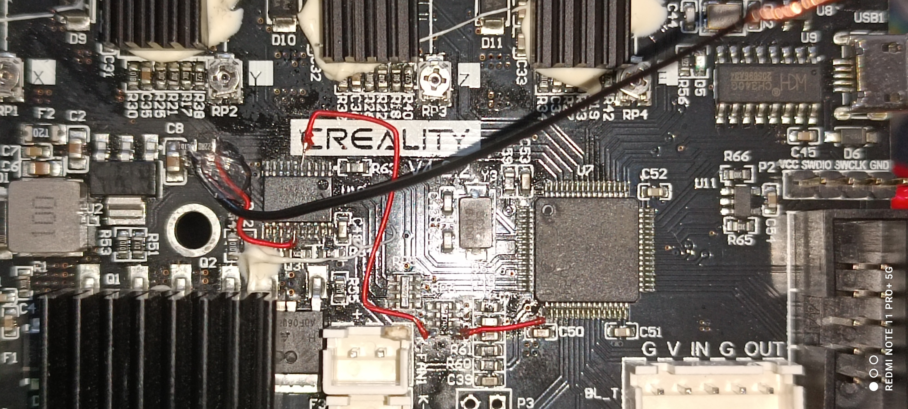

# Dil Seçimi
[English](README.md) | [Türkçe](README-tr.md)

# Ender3 V2 için Kasa Işığı Aktifleştirme

Bu kılavuz, Ender3 V2 ana kartını modifiye ederek kasa ışığı kontrolü eklemenin detaylı talimatlarını sunar. Bu işlemin temel elektronik bilgisi ve lehimleme becerisi gerektirdiğini unutmayın. Devam etmek kendi sorumluluğunuzdadır; donanım hasarı meydana gelebilir ve bu modifikasyonlardan kaynaklanan sorunlardan sorumlu değiliz.

---

## Genel Bakış

Ender3 V2 ana kartı doğrudan kasa ışığı çıkışı desteklemez. Ancak, Marlin firmware bu işlevi destekler. Bazı donanım değişiklikleri yaparak kullanılmayan bir işlemci pinini LED aydınlatmayı kontrol etmek için kullanabiliriz. Bu amaçla kullanacağımız spesifik pin **PA3** olacaktır.

---

## Gerekli Malzemeler

Bu modifikasyonu tamamlamak için aşağıdaki bileşenlere ihtiyacınız olacak:

- **1 x 100k Direnç**
- **1 x 10Ω Direnç**
- **1 x N-Channel MOSFET** (en az 30V Drain-Source Voltage'a sahip):
  - Tavsiye Edilen: HY1403 (Ender3 V2 üzerinde hotend ve heated bed devrelerinde kullanılır).
  - Alternatif: FR024N (daha kolay temin edilebilir ve bu uygulama için eşit derecede uygundur).
- **Lehimleme Araçları**: Havya, lehim ve flux.
- **Opsiyonel**: MOSFET entegrasyonu için bir breakout kart.
- **Önemli Not**: Bu modifikasyonda kullanılacak LED ışık 24V ile çalışmalıdır çünkü MOSFET, 24V hattından gelen gücü kontrol eder.

---

## Donanım Değişiklikleri

1. **Devre Şeması**:  
   Modifikasyon şeması aşağıda gösterilmiştir:
   
   
   
   - Şemadaki kırmızı çizgiler ana karta eklemeniz gereken bağlantıları gösterir.

2. **MOSFET Seçimi**:
   - Eğer Ender3 V2 üzerinde kullanılan HY1403 MOSFET'lere erişiminiz varsa, bunlar idealdir.
   - Alternatif olarak, daha kolay temin edilebilen FR024N MOSFET'i kullanabilirsiniz.

3. **Entegrasyon**:  
   MOSFET'i kasa ışığı aktifleştirme için entegre etmek için şu adımları izleyin:

   1. **PA3 Pin Bağlantısı**: MCU'nun PA3 pininden bir kabloyu RP6 direnç paketinin boş kanalına bağlayın.
   
   2. **Bus Transceiver Bağlantısı**: RP6 direnç paketinin boş kanalından bir kabloyu HC245 bus transceiver'ın kullanılmayan bir kanalına (tercihen A3 pin, A3 seçilirse çıkış olara B3 kullanılacak) bağlayın.

   3. **Seri Direnç**: Seçilen kanalın (A3 ise B3) çıkış tarafına 10Ω direnç bağlayın.

   4. **MOSFET Gate Bağlantısı**: 10Ω direncin diğer ucunu MOSFET'in gate pinine bağlayın.

   5. **Pulldown Resistor**: MOSFET gate'ine 100kΩ pulldown resistor ekleyin.

   6. **Source Pin Bağlantısı**: MOSFET'in source pinini GND'ye bağlayın.

   7. **Drain Pin Bağlantısı**: MOSFET'in drain pinini LED'in negatif terminaline bağlayın.

   8. **LED Güç Bağlantısı**: LED'in pozitif terminalini doğrudan 24V'ye bağlayın. LED'in 24V çalışmaya uygun olduğundan emin olun çünkü bu modifikasyon ışıklandırma için 24V gücü anahtarlamaktadır.
   
---

## Montaj Referansı

Montajın tamamlanmış haline ilişkin fotoğraflar size yardımcı olacaktır:




**Not**: Bu görüntüler, MOSFET gate'ine kadar olan bağlantıları göstermektedir. MOSFET'in kendisi uzay montaj bağlanmıştır, bu yüzden görüntülerde görünmemektedir.

---

## Yazılım Yapılandırması

Kasa ışığı işlevselliğini Marlin firmware'de aktifleştirmek için aşağıdaki iki seçeneği takip edin:

### Seçenek 1: Repodaki Önceden Yapılandırılmış Firmware'i Kullan

Bu ayarlarla önceden yapılandırılmış firmware'i kullanabilirsiniz. Repodaki firmware'i indirin, Ender3 V2'nize yükleyin ve kasa ışığı kontrolü hazır hale gelir.

Repo Bağlantısı: [https://github.com/sezgynus/Ender3V2S1](https://github.com/sezgynus/Ender3V2S1)

### Seçenek 2: Firmware'i Manuel Olarak Yapılandır ve Derle

Kasa ışığı aktifleştirme için Marlin firmware'i yapılandırmak üzere şu adımları takip edin:

1. **Kasa Işığı İşlevini Aktifleştirme**

   `Configuration_adv.h` dosyasını açın ve aşağıdaki satırı değiştirerek kasa ışığı işlevini aktifleştirin:
   ```cpp
   //#define CASE_LIGHT_ENABLE
   #define CASE_LIGHT_ENABLE
   ```

2. **Kasa Işığı Pinini Ayarlama**

   Kasa ışığı için pini tanımlayın. Aynı dosyada şu satırı değiştirin:
   ```cpp
   //#define CASE_LIGHT_PIN 4
   #define CASE_LIGHT_PIN PA3
   ```

3. **Menüde Kasa Işığını Aktifleştirme**

   Kasa ışığını menü üzerinden kontrol etmek istiyorsanız, bu seçeneği şu şekilde etkinleştirin:
   ```cpp
   //#define CASE_LIGHT_MENU
   #define CASE_LIGHT_MENU
   ```
   Bu özelliği etkinleştirirseniz, menüler aşağıdaki gibi görünecektir:
   <div style="display: flex; justify-content: space-between;">   </div>

4. **Opsiyonel: Fast PWM'i Etkinleştirme (Titreşim Azaltır)**

   Düşük parlaklık seviyelerinde özellikle titreşimi azaltmak için yüksek PWM frekansını etkinleştirin:
   ```cpp
   //#define FAST_PWM_FAN
   #define FAST_PWM_FAN
   ```

5. **PWM Frekansını Ayarlama**

   Bir önceki adımda fast PWM'i etkinleştirdiyseniz, doğru frekansı ayarlamak için şu satırı etkinleştirin:
   ```cpp
   //#define FAST_PWM_FAN_FREQUENCY 31400
   #define FAST_PWM_FAN_FREQUENCY 31400
   ```

6. **Kasa Işığının Varsayılan Durumunu Ayarlama**

   Kasa ışığının yazıcı açıldığında varsayılan olarak açık mı kapalı mı olacağını tanımlayın:
   ```cpp
   #define CASE_LIGHT_DEFAULT_ON true
   #define CASE_LIGHT_DEFAULT_ON false
   ```

   **Açıklama**:  
   - Yazıcı açıldığında ışığın otomatik olarak açılmasını istiyorsanız, `true` olarak bırakın.
   - Yazıcı açıldığında ışığın kapalı kalmasını istiyorsanız, `false` olarak değiştirin.

7. **Kasa Işığının Varsayılan Parlaklık Seviyesini Ayarlama**

   Kasa ışığının başlangıç parlaklık seviyesini ayarlayın:
   ```cpp
   #define CASE_LIGHT_DEFAULT_BRIGHTNESS 105
   #define CASE_LIGHT_DEFAULT_BRIGHTNESS 255
   ```

   **Açıklama**:  
   - `0` değeri minimum parlaklığı temsil eder.
   - `255` değeri maksimum parlaklığı temsil eder.
   - Parlaklığı tercihinize göre ayarlayabilirsiniz.

Bu değişiklikler yapıldıktan sonra dosyayı kaydedin ve yazıcınız için firmware'i derlemeye devam edin. Güncellenmiş firmware'i yükleyerek kasa ışığı kontrolünü etkinleştirin.

---

## Notlar ve Uyarılar

- Ana kartın kapalı olduğundan ve tüm güç kaynaklarından bağlantısının kesildiğinden emin olun.
- Yazıcıyı açmadan önce tüm bağlantıları şemaya bakarak iki kere kontrol edin.
- Hatalı kurulum veya arızalı bileşenler ana kartınıza zarar verebilir.

---

Bu kılavuzu takip ederek Ender3 V2 yazıcınızda kasa ışığı kontrolünü başarıyla etkinleştirebilirsiniz. Herhangi bir sorunla karşılaşırsanız veya iyileştirme önerileriniz varsa, depoya katkıda bulunmaktan veya bir sorun bildirmekten çekinmeyin. Keyifli baskılar!
