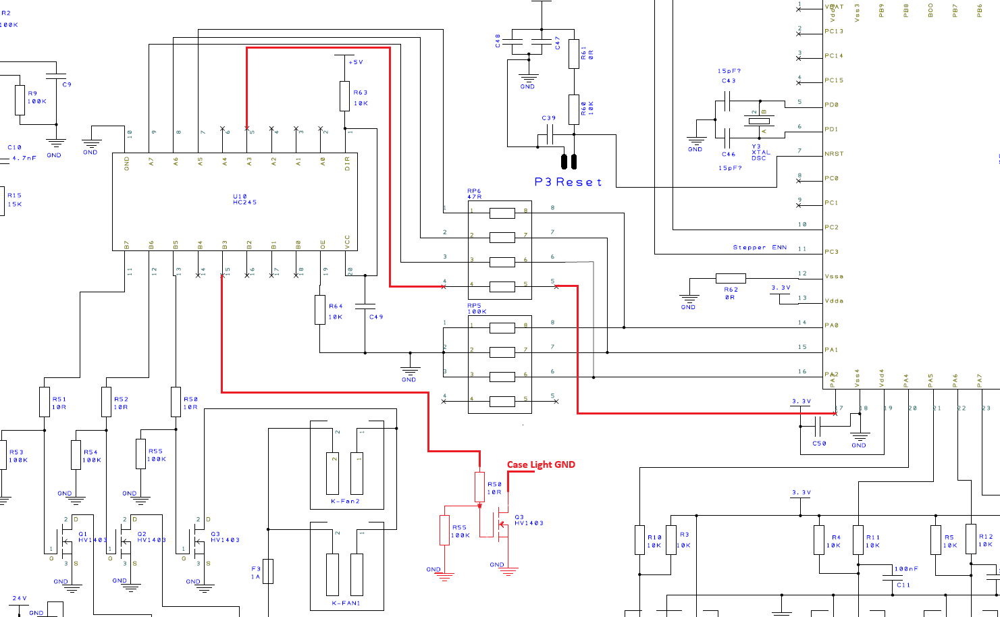
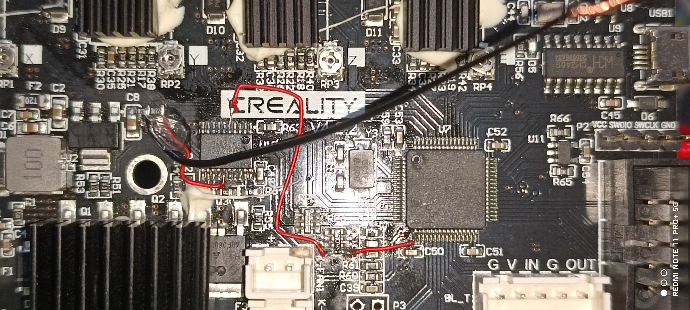
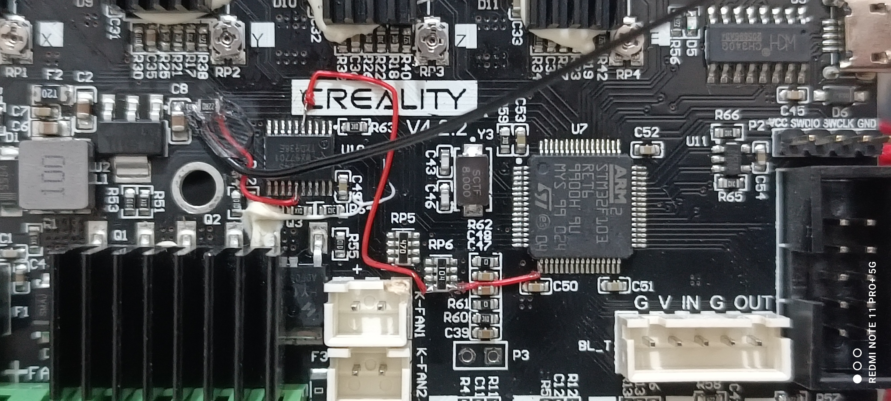

# Language Selection
[English](README.md) | [Türkçe](README-tr.md)

# Case Light Activation for Ender3 V2

This guide provides detailed instructions to modify your Ender3 V2 mainboard to enable case lighting control. Note that this process requires basic electronics knowledge and soldering skills. Proceed at your own risk, as hardware damage may occur, and we are not responsible for any issues arising from these modifications.

---

## Overview

The Ender3 V2 mainboard does not natively support a case light output. However, the Marlin firmware includes support for this functionality. By making some hardware modifications, we can repurpose an unused processor pin to control LED lighting. The specific pin we will use for this purpose is **PA3**.

---

## Required Materials

To complete this modification, you will need the following components:

- **1 x 100k Resistor**
- **1 x 10Ω Resistor**
- **1 x N-Channel MOSFET** (with at least 30V Drain-Source Voltage):
  - Recommended: HY1403 (used on the Ender3 V2 for hotend and hotbed heating circuits).
  - Alternative: FR024N (easier to source and equally suitable for this application).
- **Soldering Tools**: Soldering iron, solder, and flux.
- **Optional**: A breakout board for easier MOSFET integration.
- **Important Note**: The LED light used in this modification must operate on 24V, as the MOSFET controls the power from the 24V rail.

---

## Hardware Modifications

1. **Circuit Schematic**:  
   The modification schematic is shown below:
   
   
   
   - The red lines in the schematic indicate the connections you need to add to the mainboard.

2. **MOSFET Selection**:
   - If you have access to the HY1403 MOSFETs used on the Ender3 V2 for other functions, they are ideal.
   - Alternatively, use the FR024N MOSFET, which is more readily available.

3. **Integration**:  
   Follow these steps to integrate the MOSFET for case light activation:

   1. **PA3 Pin Connection**: From the MCU's PA3 pin, route a wire to the empty channel of the RP6 package resistor.
   
   2. **Bus Transceiver Connection**: From the empty channel of the RP6 resistor, connect a wire to one of the unused channels of the HC245 bus transceiver (A3 pin is preferred, but B3 can be used if A3 is occupied).

   3. **Series Resistor**: On the output side of the chosen channel (A3 or B3), attach a series 10Ω resistor.

   4. **MOSFET Gate Connection**: Connect the other end of the 10Ω resistor to the MOSFET's gate pin.

   5. **Pulldown Resistor**: Attach a 100kΩ pulldown resistor to the MOSFET gate.

   6. **Source Pin Connection**: Connect the MOSFET's source pin to GND.

   7. **Drain Pin Connection**: Connect the MOSFET's drain pin to the negative terminal of the LED.

   8. **LED Power Connection**: Connect the positive terminal of the LED directly to 24V. Ensure the LED is rated for 24V operation, as this modification switches the 24V power for the lighting.
   
---

## Assembly Reference

Photos of the completed assembly are provided to assist you:





**Note**: These images show the connections up to the MOSFET gate. The MOSFET itself has been mounted using a flying lead (air-wired), which is why it is not visible in the images.

---

## Software Configuration

To enable the case light functionality in Marlin firmware, follow one of the two options below:

### Option 1: Use the Pre-configured Firmware from the Repository

You can use the pre-configured firmware with these settings. Simply download the firmware from the repository linked below, flash it to your Ender3 V2, and the case light control will be ready.

Repository Link: [https://github.com/sezgynus/Ender3V2S1](https://github.com/sezgynus/Ender3V2S1)

### Option 2: Manually Configure and Build the Firmware

Follow these steps to configure the Marlin firmware for case light activation:

1. **Enable Case Light Functionality**

   Open the `Configuration_adv.h` file and enable case light functionality by changing the following line:
   ```cpp
   //#define CASE_LIGHT_ENABLE
   #define CASE_LIGHT_ENABLE
   ```

2. **Set the Case Light Pin**

   Define the pin for the case light. In the same file, change:
   ```cpp
   //#define CASE_LIGHT_PIN 4
   #define CASE_LIGHT_PIN PA3
   ```

3. **Enable Case Light in the Menu**

   If you want to control the case light via the menu, enable this option by changing:
   ```cpp
   //#define CASE_LIGHT_MENU
   #define CASE_LIGHT_MENU
   ```
   If you enable this feature, the menus will look like the images below:
   <div style="display: flex; justify-content: space-between;">   </div>

5. **Optional: Enable Fast PWM(Reduces Flicker)**

   To reduce flicker, especially at low brightness levels, enable high PWM frequency by changing:
   ```cpp
   //#define FAST_PWM_FAN
   #define FAST_PWM_FAN
   ```

6. **Set PWM Frequency**

   If you enabled fast PWM in the previous step, enable the following to set the correct frequency:
   ```cpp
   //#define FAST_PWM_FAN_FREQUENCY 31400
   #define FAST_PWM_FAN_FREQUENCY 31400
   ```

7. **Set the Default State of the Case Light**

   Define whether the case light should be ON or OFF by default when the printer is powered on. Modify this line:
   ```cpp
   #define CASE_LIGHT_DEFAULT_ON true
   #define CASE_LIGHT_DEFAULT_ON false
   ```

   **Explanation**:  
   - If you want the light to turn ON automatically when the printer starts, leave it as `true`.
   - If you want the light to remain OFF when the printer starts, change it to `false`.

8. **Set the Default Brightness of the Case Light**

   Set the initial brightness level of the case light. Change the following line:
   ```cpp
   #define CASE_LIGHT_DEFAULT_BRIGHTNESS 105
   #define CASE_LIGHT_DEFAULT_BRIGHTNESS 255
   ```

   **Explanation**:  
   - The value `0` represents the minimum brightness.
   - The value `255` represents the maximum brightness.
   - You can adjust the brightness to your preference.

Once these changes are made, save the file and proceed to build the firmware for your printer. Flash the updated firmware to enable case lighting control.

---


## Notes and Warnings

- Ensure the mainboard is powered off and disconnected from all power sources before starting.
- Double-check all connections against the schematic before powering on the printer.
- Improper installation or faulty components may damage your mainboard.

---

By following this guide, you can successfully enable case lighting control on your Ender3 V2 printer. If you encounter any issues or have suggestions for improvement, feel free to contribute or open an issue in this repository. Happy printing!
