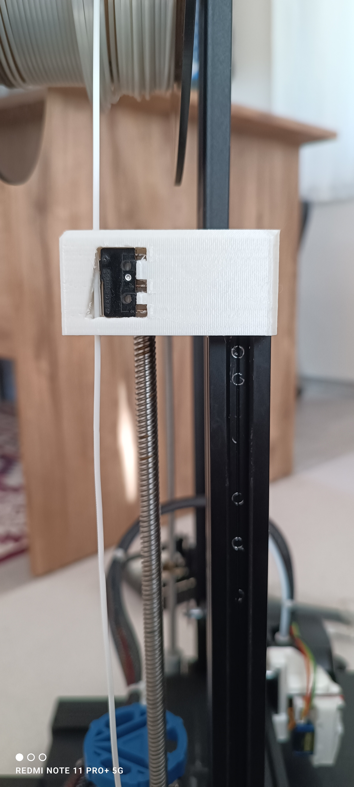
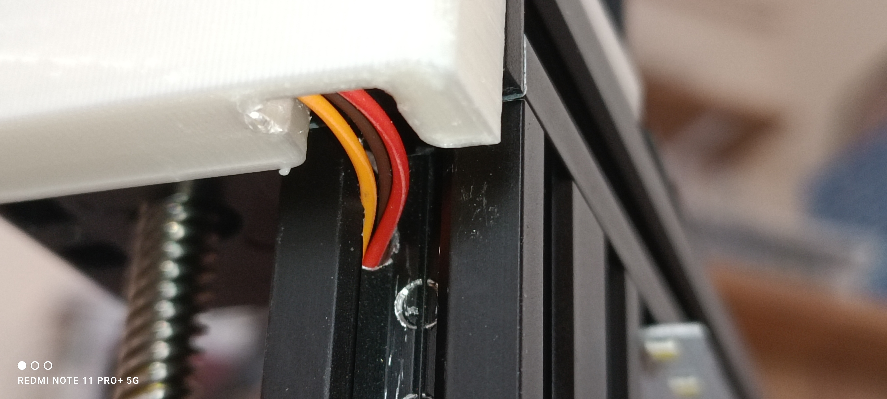
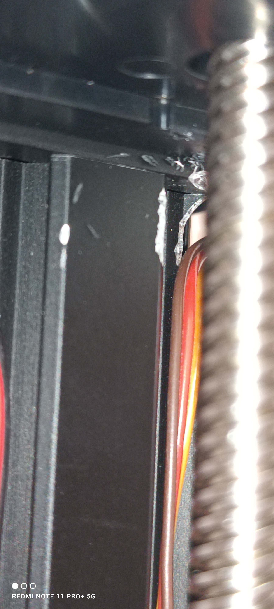
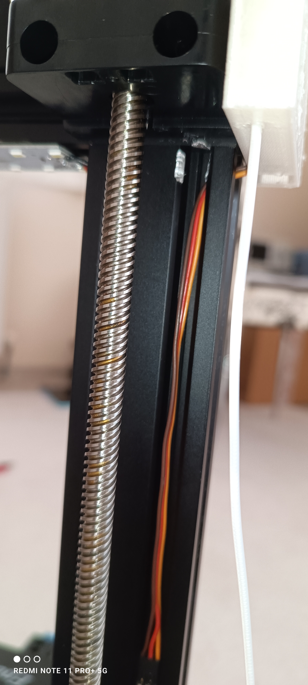

# Filament Sensor — Ender 3 V2

[English](README.md) | [Türkçe](README-tr.md) | [← Main Guide](../README.md)

This section preserves the **filament-sensor installation evidence** currently available for the Ender 3 V2 upgrade project. The repository contains an animated demonstration and four installation photographs.

## Available Material

| Asset | Content |
|---|---|
| `Photos/1.gif` | Animated demonstration of the implemented filament-sensor setup |
| `Photos/1.jpg` | Installation reference |
| `Photos/2.jpg` | Installation reference |
| `Photos/3.jpg` | Installation reference |
| `Photos/4.jpg` | Installation reference |

## Installation References

  
  

  
  

## Documentation Scope

No wiring table, mainboard pin assignment, sensor part number, or firmware configuration is stored in this section of the repository. Those details are therefore **not inferred from the photographs**.

The purpose of this sub-guide is to make the existing implementation material discoverable without presenting undocumented technical assumptions as installation instructions.

## Status

| Area | Status |
|---|---|
| Physical implementation | Demonstrated |
| Installation photographs | Available |
| Animated demonstration | Available |
| Wiring documentation | Not present in repository |
| Firmware configuration | Not present in repository |

[← Return to the main upgrade guide](../README.md)
