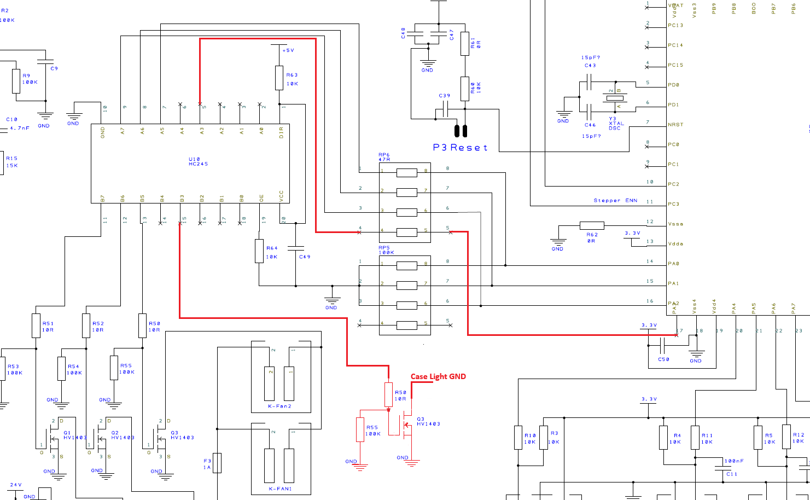

# Ender 3 V2 Yükseltme Kılavuzu

[English](README.md) | [Türkçe](README-tr.md)

**Creality Ender 3 V2** için uygulanmış donanım ve firmware modifikasyonlarını belgeleyen pratik bir kaynak koleksiyonudur. Depo; gerçek donanım üzerinde uygulanmış yükseltmelere odaklanır ve bu çalışmaların tekrar uygulanabilmesi için mevcut kablolama, yapılandırma, şema, fotoğraf ve demonstrasyon materyallerini bir araya getirir.

## Projeye Genel Bakış

Kılavuz şu anda üç yükseltme alanını kapsamaktadır:

| Yükseltme | Amaç | Dokümantasyon |
|---|---|---|
| [BFPTouch Sensörü](./BFPTouch_Sensor/README-tr.md) | SG90 servo ve optik endstop ile düşük maliyetli otomatik tabla probu eklemek | Donanım kurulumu, kablolama, firmware yaklaşımı, fotoğraflar ve demonstrasyonlar |
| [Kasa Işığı](./Case_Light/README-tr.md) | Ender 3 V2 anakartına firmware kontrollü 24 V kasa aydınlatması eklemek | Anakart modifikasyonu, şema, Marlin yapılandırması ve montaj fotoğrafları |
| [Filament Sensörü](./Filament_Sensor/README-tr.md) | Filament varlığını algılamak | Kurulum fotoğrafları ve demonstrasyon materyalleri |

Depo, birbirinden bağımsız modifikasyonlar şeklinde düzenlenmiştir. Belgelenen her yükseltme diğerlerine ihtiyaç duyulmadan ayrı olarak incelenebilir.

## Hızlı Bakış

| Alan | Uygulama |
|---|---|
| Hedef yazıcı | Creality Ender 3 V2 |
| Firmware | Marlin |
| Otomatik tabla probu | BFPTouch / BLTouch benzeri işlev |
| Prob donanımı | SG90 servo + optik endstop |
| Kasa ışığı kontrolü | MCU PA3 → HC245 → MOSFET |
| Kasa ışığı beslemesi | 24 V |
| Kasa ışığı komutu | Marlin `M355` |
| Parlaklık aralığı | 0–255 |
| Dokümantasyon | İngilizce ve Türkçe |
| Destekleyici materyal | Şemalar, kablolama bilgileri, fotoğraflar ve GIF demonstrasyonları |

## Yükseltme Kılavuzları

### 1. BFPTouch Sensörü

[BFPTouch kurulum kılavuzunu aç →](./BFPTouch_Sensor/README-tr.md)

BFPTouch modifikasyonu; 3D baskılı bir montaj parçası, **SG90 servo motor** ve **optik endstop** kullanarak BLTouch benzeri prob işlevi sağlar. BFPTouch, BLTouch üzerindeki kontrolcüye sahip olmadığından servo sinyali doğrudan mekanik açıyı kontrol eder ve uyumlu firmware yapılandırması gerektirir.

Mevcut kılavuz şunları içerir:

- bileşen ve montaj gereksinimleri;
- Ender 3 V2 anakart kablolaması;
- BFPTouch/BLTouch kontrol farkının açıklaması;
- önceden yapılandırılmış firmware ve manuel Marlin yapılandırma seçenekleri;
- kurulum fotoğrafları ve animasyonlu demonstrasyonlar.


### 2. Kasa Işığı Kontrolü

[Kasa ışığı modifikasyon kılavuzunu aç →](./Case_Light/README-tr.md)

Ender 3 V2 anakartında özel bir kasa ışığı çıkışı bulunmamasına rağmen Marlin kasa ışığı kontrolünü destekler. Bu modifikasyonda **PA3** MCU pini yeniden kullanılır; kullanılmayan bir HC245 kanalı ve harici N-channel MOSFET üzerinden **24 V LED yükü** anahtarlanır.

Belgelenen sinyal yolu:

```text
MCU PA3
   │
   ▼
RP6 direnç ağı
   │
   ▼
Kullanılmayan HC245 kanalı
   │
   ▼
10 Ω seri direnç
   │
   ▼
N-channel MOSFET
   │
   ▼
24 V kasa ışığı
```

Kılavuz; anakart modifikasyon şemasını, bileşen seçimini, lehimleme referanslarını, montaj fotoğraflarını ve gerekli Marlin ayarlarını içerir.



#### Marlin Kontrolü

Kasa ışığı kontrolü Marlin'in `M355` komutu üzerinden sağlanır:

```text
M355 [P<byte>] [S<bool>]
```

- `P<byte>`: **0–255** arasında parlaklık
- `S<bool>`: ışığın açık/kapalı durumu

Firmware yapılandırmasında ayrıca menü kontrolü, **31,4 kHz** fast PWM seçeneği, başlangıç durumu ve varsayılan parlaklık ayarları belgelenmiştir.

### 3. Filament Sensörü

[Filament sensörü dizinini aç →](./Filament_Sensor/README-tr.md)

Filament sensörü bölümü, depoda şu anda doğrulanabilen materyali belgeler: kurulum fotoğrafları ve animasyonlu demonstrasyon. Alt kılavuz yalnızca bu mevcut kanıtlara dayanır; depoda bulunmayan kablolama ve firmware ayrıntıları türetilmez.

## Dokümantasyon Yaklaşımı

Bu depodaki materyal, olası Ender 3 V2 yükseltmelerinin genel bir listesinden ziyade uygulanmış modifikasyonlara dayanır. Materyalin mevcut olduğu çalışmalar dört katmanda ele alınır:

```text
Donanım modifikasyonu
        ↓
Elektriksel / kablolama referansı
        ↓
Firmware yapılandırması
        ↓
Fiziksel kurulum ve doğrulama
```

Bu yapı, yalnızca hazır bir firmware binary'sine bağlı kalmak yerine hem uygulamanın hem de modifikasyonun arkasındaki yaklaşımın incelenebilmesini sağlar.

## Firmware

BFPTouch ve kasa ışığı kılavuzları iki firmware yolu sunar:

1. referans verilen önceden yapılandırılmış firmware'i kullanmak;
2. belgelenen değişiklikleri Marlin'e manuel olarak uygulayıp firmware'i derlemek.

Kılavuzlarda referans verilen önceden yapılandırılmış firmware ayrı `sezgynus/Ender3V2S1` deposunda tutulmaktadır. Manuel yapılandırma ilgili yükseltme kılavuzunda belgelendiğinden donanım modifikasyonları yalnızca hazır bir binary'ye bağlı değildir.

## Depo Yapısı

```text
Ender3-V2-Upgrade-Guide/
├── BFPTouch_Sensor/
│   ├── Photos/
│   ├── README.md
│   └── README-tr.md
├── Case_Light/
│   ├── Diagrams/
│   ├── HW_Modifications/
│   ├── Photos/
│   ├── README.md
│   └── README-tr.md
├── Filament_Sensor/
│   ├── Photos/
│   ├── README.md
│   └── README-tr.md
├── LICENSE
├── README.md
└── README-tr.md
```

## Proje Durumu

| Alan | Durum |
|---|---|
| BFPTouch donanım kurulumu | Belgelenmiş |
| BFPTouch kablolaması | Belgelenmiş |
| BFPTouch firmware yaklaşımı | Belgelenmiş |
| Kasa ışığı donanım modifikasyonu | Belgelenmiş |
| Kasa ışığı Marlin yapılandırması | Belgelenmiş |
| Kasa ışığı montaj referansları | Belgelenmiş |
| Filament sensörü görsel materyalleri | Mevcut |
| Filament sensörü görsel materyal kılavuzu | Mevcut depo materyalinden belgelenmiş |

Bu genel bakışta belgelenmemiş teknik ayrıntılar türetilmemiştir; durum tablosu yalnızca depoda şu anda bulunan materyali yansıtır.

## Güvenlik

Kasa ışığı modifikasyonu doğrudan yazıcı anakartına lehimleme yapılmasını ve 24 V yük anahtarlanmasını gerektirir. Anakart üzerinde çalışmadan önce yazıcının güç bağlantısını kesin, enerji vermeden önce şema ve kablolamayı doğrulayın ve seçilen MOSFET ile LED donanımının kılavuzda belirtilen elektriksel koşullara uygun olduğundan emin olun.

## Lisans

Bu proje [MIT Lisansı](LICENSE) altında lisanslanmıştır.
